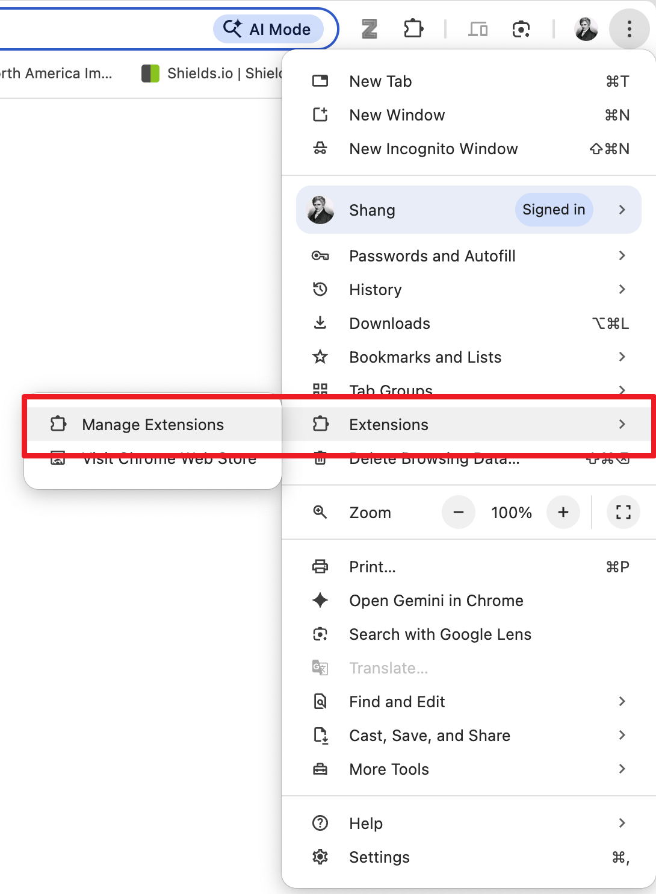
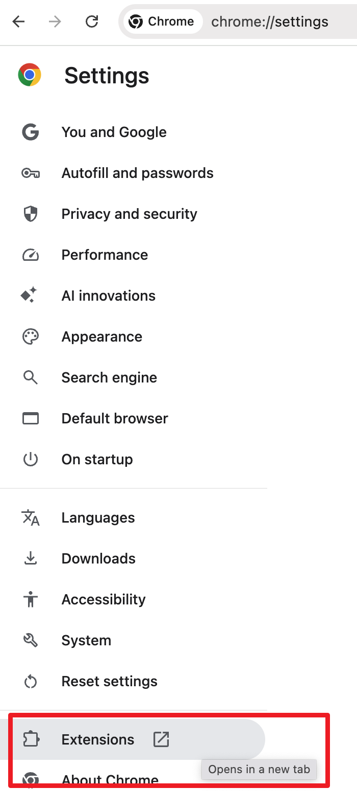
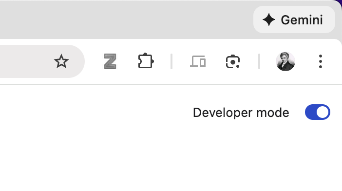
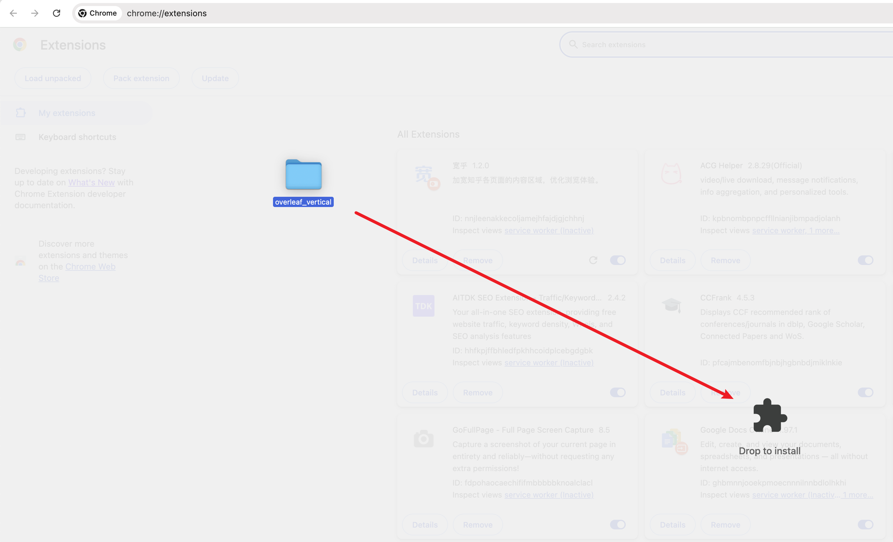
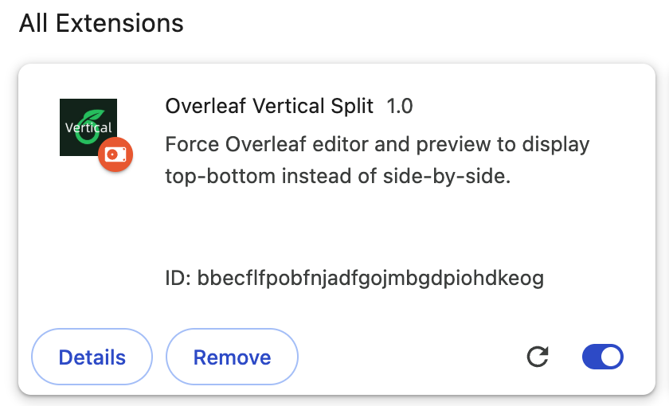

Requirements: Chromium-based browser(Like Chrome)

1. Click the "Extension" button Or go to Chrome settings

  
  

2. Open the Developer mode

  

3. Download the extension from release, and unzip the file.

4. Drag rhe dictionary to the extension space.

  

5. Make sure the extension is opened.

  

