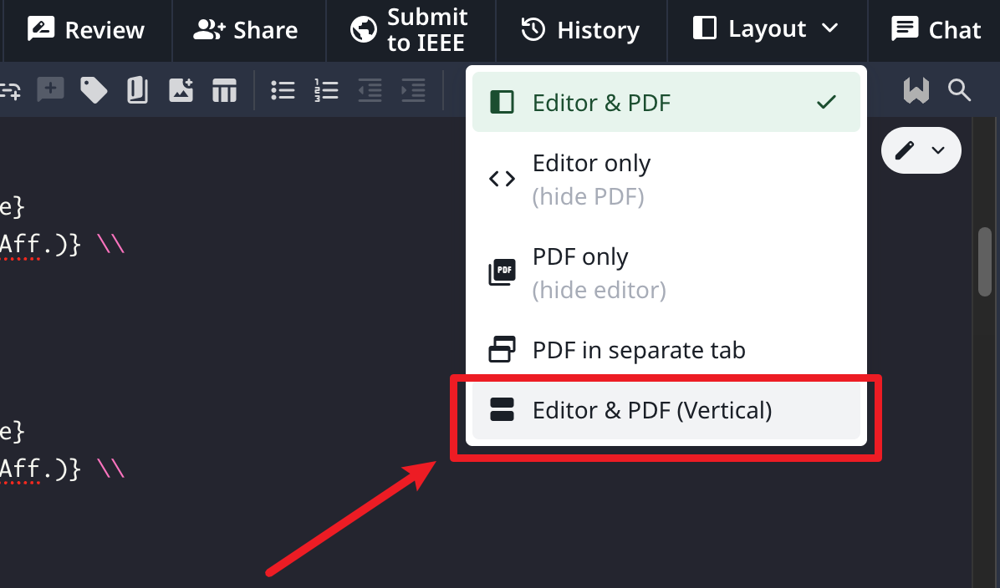
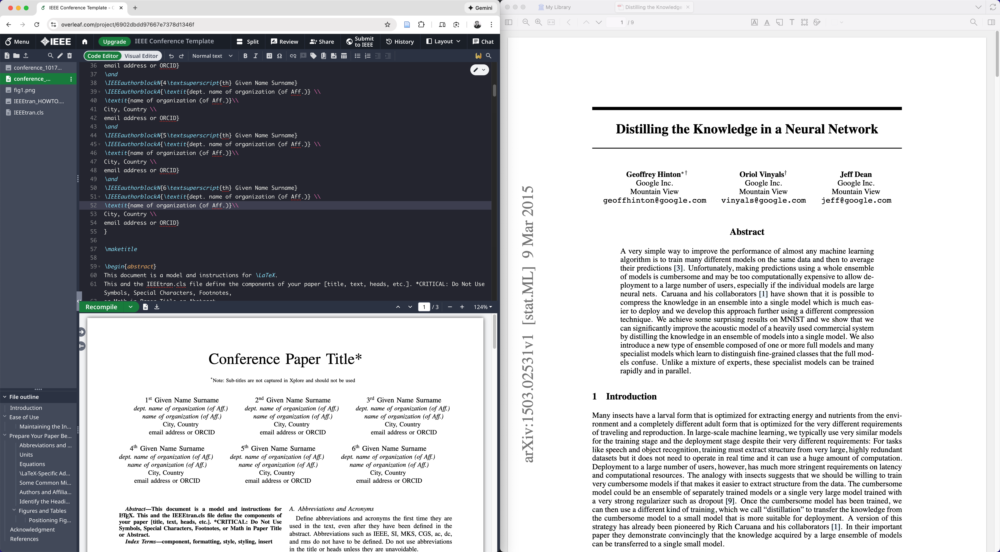
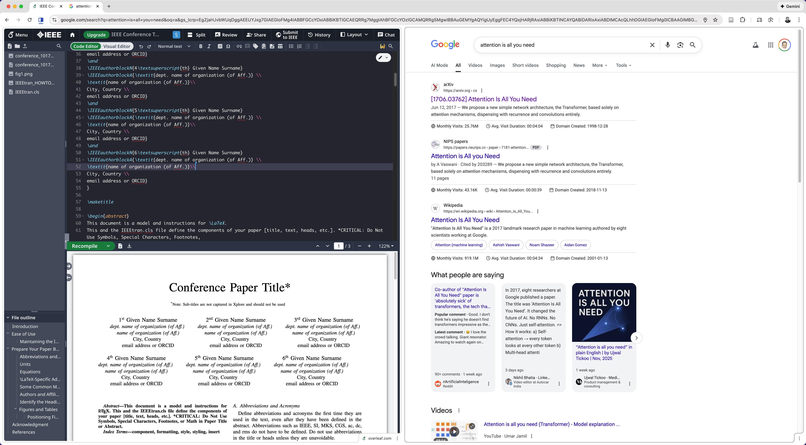

    

    <a href="./README.md">English</a> | 中文

# Overleaf Vertical
🔥强制 Overleaf 编辑器和PDF预览从上到下显示，而不是并排显示

👀亮点:

1. Overleaf平台的开源扩展
2. 更有效地利用屏幕空间, 一边写论文一边查文献。
3. 只需一个简单的按钮即可轻松切换 Overleaf 布局
4. 可调整分隔条 - 拖动以调整垂直分割比例
5. 多域名支持 - 支持 cn.overleaf.com 和自托管实例
6. 通过 GitHub Actions 自动构建

  

  

# 功能特性

## 切换垂直/水平布局
点击 Overleaf 工具栏中的 "Split" 按钮,即可在垂直(上下)和水平(左右)布局之间切换。

## 可调整分隔条
在垂直模式下,您可以拖动编辑器和 PDF 预览之间的分隔条来调整分割比例。只需点击并拖动分隔条到您喜欢的位置即可。

## 多域名支持
该扩展支持:
- www.overleaf.com (默认)
- cn.overleaf.com (中文版)
- 自托管的 Overleaf 实例

添加自定义域名(每次添加一个):
1. 右键点击扩展图标并选择"选项"
2. 在输入框中输入您的自定义域名模式
3. 点击"Add Domain"按钮
4. 重复步骤 2-3 以添加更多域名
5. 重新加载您的 Overleaf 页面

**域名模式示例:**
- `*://cn.overleaf.com/*` - 中国 Overleaf
- `*://latex.sysu.edu.cn/*` - 中山大学 LaTeX
- `*://overleaf.mycompany.com/*` - 公司自托管实例
- `*://*.overleaf.com/*` - 所有 Overleaf 子域名

## 自动构建
该扩展使用 GitHub Actions 自动构建和打包。从 [Releases](https://github.com/liuup/overleaf_vertical/releases) 页面下载最新版本。

# 安装指南
查看 [安装指南](./Installation_zh.md)

# 最佳实践

  左: Overleaf | 右: Zetero  
   
  

  左: Overleaf | 右: Website  
   
  

# 开源许可

MIT
